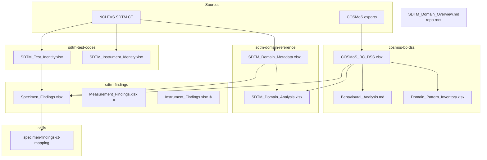

# cdisc-for-ai

Machine-actionable reference files for CDISC clinical data standards — designed for both human review and AI consumption.

## Why

CDISC standards are published as PDFs, spreadsheets, and APIs. They can be used by automated systems, but AI puts new focus on making them work at the language level — for both human and artificial intelligence. The information is there. But it is scattered across multiple sources with no machine-traversable connections between them, and the flat formats hide the semantic structure that both humans and automated systems need to reason correctly.

A significant share of automated protocol-to-CDISC translation failures are not caused by missing vocabulary — the concepts exist. They fail because the standards lack the machine-traversable connections needed for automated systems to resolve them. These are infrastructure gaps, not knowledge gaps.

This repository builds flat, self-describing reference files that make existing CDISC standards machine-actionable — following FAIR data principles. Laboratory and measurement standards are the focus area.

For how the analytical layers fit together — CT discovery, domain classification, and COSMoS behavioural analysis — see [`SDTM_Domain_Overview.md`](SDTM_Domain_Overview.md).

## Context

The Unified Study Definitions Model (USDM), CDISC's 360i initiative, and the broader move toward structured, machine-readable protocols are creating demand for standards that work as computable building blocks — not just documentation. When study designs are expressed as data, the standards they reference must also be data.

## Tracks

The repository is organized into source tracks, a reference track, and consumer tracks. Source tracks extract and enrich from upstream standards. The reference track provides shared domain metadata. Consumer tracks join source data into structural-type-specific outputs for study design and mapping workflows.

Each reference file is self-describing — with a README sheet documenting columns, provenance, and design decisions.

### Source tracks

| Track | Question | Output | Source |
|---|---|---|---|
| [`sdtm-test-codes/`](sdtm-test-codes/) | What is measured? | `SDTM_Test_Identity.xlsx` — domain-level test codes | NCI EVS, NCIt, UMLS |
| | | `SDTM_Instrument_Identity.xlsx` — instrument-level test codes | |
| [`cosmos-bc-dss/`](cosmos-bc-dss/) | How is it measured? | `COSMoS_BC_DSS.xlsx` — flattened BC/DSS interim file | COSMoS BC/DSS exports |
| | What are the behavioural patterns? | [`COSMoS_Behavioural_Analysis.md`](cosmos-bc-dss/docs/COSMoS_Behavioural_Analysis.md), [`COSMoS_Domain_Pattern_Inventory.xlsx`](cosmos-bc-dss/docs/COSMoS_Domain_Pattern_Inventory.xlsx) | |

### Reference track

| Track | Purpose | Output |
|---|---|---|
| [`sdtm-domain-reference/`](sdtm-domain-reference/) | Domain metadata — structural types, COSMoS coverage flags, specimen/instrument classification | `SDTM_Domain_Metadata.xlsx` (pipeline input) |
| | Structural type + behavioural group classification per domain | `SDTM_Domain_Analysis.xlsx` (analysis) |

### Consumer tracks

| Track | Structural type | Scope | Output |
|---|---|---|---|
| [`sdtm-findings/`](sdtm-findings/) | Specimen-based | Domains with `Specimen_Based=Yes` in Domain_Metadata | `Specimen_Findings.xlsx` |
| | Instrument-based | QS, FT, RS | `Instrument_Findings.xlsx` *(planned)* |
| | Measurement | VS, EG, MK, CV | `Measurement_Findings.xlsx` *(planned)* |

Consumer files are two-sheet Excel workbooks: **Test_Identity** (one row per TESTCD, enriched with COSMoS summary) and **Measurement_Specs** (one row per Dataset Specialization, scoped to the relevant domains). The link between sheets is TESTCD. This two-step structure matches the mapping workflow: first resolve a term to a concept, then select the specific measurement variant.

## Skills

AI mapping skills that consume the reference files.

| Skill | Purpose | Reference file |
|---|---|---|
| [`specimen-findings-ct-mapping/`](skills/specimen-findings-ct-mapping/) | Map specimen-based terms to SDTM CT — two-level resolution (TESTCD → DS_Code) | `Specimen_Findings.xlsx` |
| [`sdtm-ct-analysis/`](skills/sdtm-ct-analysis/) | Structural analysis of SDTM Controlled Terminology — category discovery and profiling | NCI EVS SDTM CT file |

## Data flow

*❋ = planned*

## Design decisions

**Why flat files?** Excel files with README sheets reach the broadest audience — data managers, statisticians, LLMs, rule engines. The graph exists in COSMoS; we project it into a consumable view. *One Graph — Many Views.*

**Why "machine-actionable" not "AI-friendly"?** Applies to any automated system, not just LLMs. Aligns with FAIR data principles.

**Why interim/?** Downloads are external. Interim files are our own pipeline artifacts — visible because they have value as standalone artifacts, even if not the final product.

**Why COSMoS vocabulary in column names?** The consumer files keep COSMoS source vocabulary (DS_Code, DS_Name, BC_Name, Domain_Class) rather than translating to study-design-friendly alternatives. Consumers are CDISC-literate; traceability to source trumps consumer-friendliness.

**Why three consumer notebooks?** The three Findings structural types (specimen-based, instrument-based, measurement) have fundamentally different data shapes and join logic. Splitting by structural type keeps each notebook focused and its output consumable.

## Status

Early and exploratory. Not a finished product. Built with AI assistance — will evolve through interaction with the CDISC community.

## Author

Kerstin Forsberg — information architect specializing in clinical data standards.
