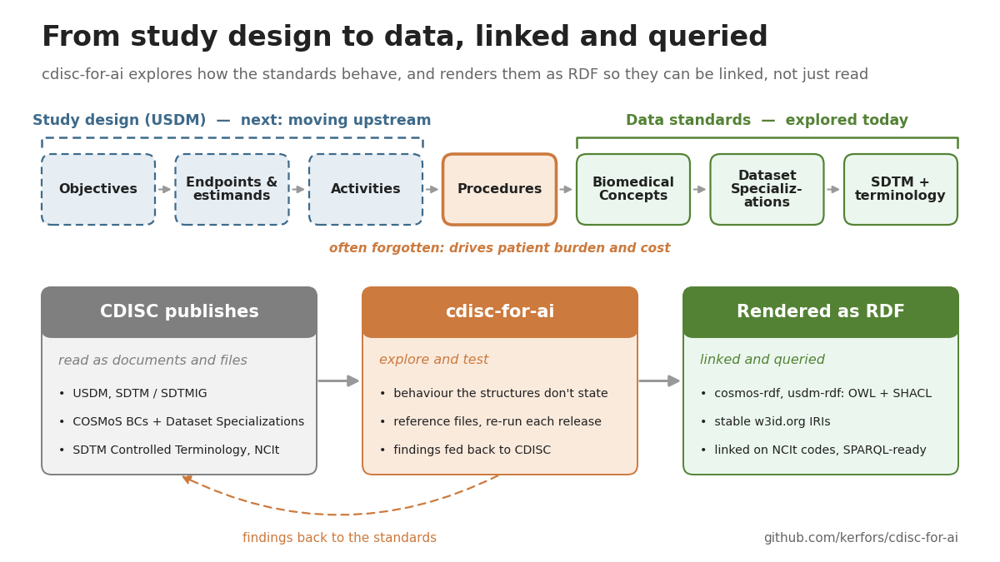

# cdisc-for-ai

Explorative work on the CDISC clinical data standards, using linked data principles. The aim is to understand the behaviour of the standards: the underlying patterns that their data structures say nothing about. It produces machine-actionable reference files -- designed for both human review and AI consumption.

**Landing page:** [kerfors.github.io/cdisc-for-ai](https://kerfors.github.io/cdisc-for-ai/) -- all reference files in one place, at the latest SDTM CT and COSMoS releases.

> **Reference versions** — SDTM CT 2026-09-25 (NCI EVS), COSMoS BC/DSS 2026-07-14, SDTMIG v3.4. Latest release note: [`docs/Changes_2026-10.md`](docs/Changes_2026-10.md) (corrections at SDTM CT 2026-09-25). Previous: [`docs/Changes_2026-09.md`](docs/Changes_2026-09.md) (SDTM CT 2026-09-25 refresh), [`docs/Changes_2026-08.md`](docs/Changes_2026-08.md), [`docs/Changes_2026-06.md`](docs/Changes_2026-06.md), [`docs/Changes_2026-05.md`](docs/Changes_2026-05.md), [`docs/Changes_2026-04.md`](docs/Changes_2026-04.md).

## Purpose

This repository is explorative work. The aim is to make the most of the CDISC standards using linked data principles, and to actually understand what the standards express and which insights they are built on.

The method is to uncover behaviour: the implicit patterns in what the published content actually does, as opposed to what the schema and the documentation say it does. The behaviour is measurable from CDISC's own published content, so the evidence does not depend on any theory about how the standards ought to be modelled. A new release is a good moment to see it, because you can watch the standards change their mind.

This is the test bed. Ideas are explored here first. The reference files here -- flat Excel files for now -- are deliverables in their own right. The long-run aim is to publish them as RDF/OWL that can express that underlying behaviour, related to established ontologies, so the standards can take part in the picture above: from study design to data, linked and queried.

Related, early work: `cosmos-rdf` renders COSMoS as RDF, as published. Rendering it as-is is itself a way to reveal how COSMoS behaves.

On the data side, the way forward is set out in [`docs/Observables_Direction.md`](docs/Observables_Direction.md): find out what identifies an observable, make the reference files express it, then move towards RDF/OWL.

The next step is upstream: to understand the data standards in relation to study design -- objectives, endpoints, estimands, and the activities and procedures that produce the data. Procedures are the part we often forget, yet they drive much of the patient burden and cost. USDM links an activity both to its procedures and to Biomedical Concepts, so the bridge is there to explore. What the standards do not state is which concept is read from which procedure. SDTM has a domain for procedures (PR), and COSMoS has a few Biomedical Concepts for it, but these record the procedure itself, not what is read from it.

## Why

Behind every TESTCD/TEST pair sits an NCIt concept with its own identity, definition, synonyms, and connections to broader biomedical vocabularies. Dataset Specializations add measurement specifications: specimen, method, units, LOINC. These linkages already exist, but scattered across CT files, COSMoS exports and NCIt, and a human must reconstruct the connections. Structured study definitions (USDM, 360i, OpenStudyBuilder) push this specificity upstream into study design, where it has to be explicit and machine-readable from the start. What is missing is not content but machine-traversable connections between concepts that already exist.

The reference files make those connections explicit today, as flat files with clear keys across sheets and tracks. Flat files are views, not the architecture: the relationships are graph-shaped, and the goal is the standards as a graph that tools and AI can traverse directly. *One Graph, Many Views.*

## Tracks

The repository is organized into source tracks, a graph track, a reference track, a view track, consumer tracks, and an analysis track. Source tracks extract and enrich from upstream standards. The graph track projects COSMoS into a multi-sheet traversable graph. The reference track provides shared domain metadata. The view track joins the graph into per-DSS views. Consumer tracks add structural-type-specific final shaping for study design and mapping workflows. The analysis track measures behaviour across the other tracks; nothing reads from it.

Each reference file is self-describing, with a README sheet documenting columns, provenance, and design decisions.

### Source tracks

| Track | Question | Output | Source |
|---|---|---|---|
| [`sdtm-test-codes/`](sdtm-test-codes/) | What is measured? | [`SDTM_Test_Identity.xlsx`](sdtm-test-codes/machine_actionable/SDTM_Test_Identity.xlsx) -- domain-level test codes | NCI EVS, NCIt, UMLS |
| | | [`SDTM_Instrument_Test_Identity.xlsx`](sdtm-test-codes/machine_actionable/SDTM_Instrument_Test_Identity.xlsx) -- test codes bound to an instrument codelist | |
| | What instruments? | [`SDTM_Instrument_Identity.xlsx`](sdtm-test-codes/machine_actionable/SDTM_Instrument_Identity.xlsx) -- one row per instrument codelist, dual NCIt anchors (C20993 + C211913) | |
| [`cosmos-bc-dss/`](cosmos-bc-dss/) | Where does COSMoS come in, and what do its concepts hide? | The COSMoS source-ingest landing zone read by `cosmos-graph/`; observable derivation and LOINC check; qualified-BC sketches. The March 2026 behavioural analysis is archived in [`docs/archive/behavioural-analysis-2026-03/`](docs/archive/behavioural-analysis-2026-03/) | COSMoS BC/DSS exports |

### Graph track

| Track | Question | Output | Source |
|---|---|---|---|
| [`cosmos-graph/`](cosmos-graph/) | How is it measured? (multi-sheet graph) | [`COSMoS_Graph.xlsx`](cosmos-graph/interim/COSMoS_Graph.xlsx) -- BC, BC_Parents, BC_Categories, DSS, Variables, Codelists, Relationships, ... | LinkML schemas + COSMoS source |
| | Resolved against SDTM CT | [`COSMoS_Graph_CT.xlsx`](cosmos-graph/interim/COSMoS_Graph_CT.xlsx) -- CT enrichment | NCI EVS SDTM CT |

### Reference track

| Track | Purpose | Output |
|---|---|---|
| [`sdtm-domain-reference/`](sdtm-domain-reference/) | Domain metadata: observation class and consumer classification (specimen, measurement, instrument) -- the scope source for the Findings consumers | [`SDTM_Domain_Metadata.xlsx`](sdtm-domain-reference/machine_actionable/SDTM_Domain_Metadata.xlsx) (pipeline input) |

### View track

| Track | Purpose | Output |
|---|---|---|
| [`consumer-bases/`](consumer-bases/) | Joined views over the graph for consumer tracks (scope-agnostic) | [`DSS_View.xlsx`](consumer-bases/interim/DSS_View.xlsx) -- wide, one row per DSS |
| | | [`DSS_Variables_View.xlsx`](consumer-bases/interim/DSS_Variables_View.xlsx) -- long, one row per VLM-row |
| | | [`PR_DSS_Reachability.xlsx`](consumer-bases/interim/PR_DSS_Reachability.xlsx) -- procedure-forward reachability into Findings DSSs |

### Consumer tracks

| Track | Structural type | Scope | Output |
|---|---|---|---|
| [`sdtm-findings-graph/`](sdtm-findings-graph/) | Specimen-based | LB, MB, MI, CP, BS, MS, PC, PP (IS, GF, UR excluded -- see behavioural analysis) | [`Specimen_Findings.xlsx`](sdtm-findings-graph/machine_actionable/Specimen_Findings.xlsx) |
| | Measurement | VS, EG, MK, CV, RE | [`Measurement_Findings.xlsx`](sdtm-findings-graph/machine_actionable/Measurement_Findings.xlsx) |
| | Instrument-based | QS, FT, RS | [`Instrument_Findings.xlsx`](sdtm-findings-graph/machine_actionable/Instrument_Findings.xlsx) -- four-sheet (Test_Identity, Measurement_Specs, BC_Categories, BC_Parents) |

### Analysis track

| Track | Question | Output |
|---|---|---|
| [`link-semantics/`](link-semantics/) | What kind of link is it? Link kinds and provenance classes behind every NCIt and LOINC link, and C-codes used in more than one role | [`Link_Kind_Audit.xlsx`](link-semantics/interim/Link_Kind_Audit.xlsx), [`Code_Collision_Check.xlsx`](link-semantics/interim/Code_Collision_Check.xlsx) -- evidence for choosing predicates when the reference files are rendered as RDF/OWL |
| [`domain-behaviour/`](domain-behaviour/) | How does each domain behave? Fan-out, decomposition axes and scale/units per domain, re-derived from each COSMoS release; tests the exclusion claims behind the Findings consumers' scope | [`Domain_Behaviour.xlsx`](domain-behaviour/interim/Domain_Behaviour.xlsx) |

Each consumer file links its sheets on TESTCD. How the files are built from each other: [`docs/Data_Flow.md`](docs/Data_Flow.md).

## Skills

AI skills for working with CDISC standards. The reference files above are designed for skill consumption.

| Skill | Purpose | Reference file |
|---|---|---|
| [`sdtm-ct-analysis/`](skills/sdtm-ct-analysis/) | Structural analysis of SDTM Controlled Terminology: category discovery and profiling. Part of the analytical foundation behind the reference files. | NCI EVS SDTM CT file |

## Key findings

**The BC-to-DSS relationship means different things in different domains.** One BC schema and one DSS schema serve all domains, but the relationship clusters into distinct identity patterns: DSS-level identity needed (specimen-based), BC-level sufficient (measurement, instrument), protocol-driven (events, interventions), relational, and not applicable (trial design). See [`Identity_Needs_by_Behavioural_Group.md`](docs/archive/behavioural-analysis-2026-03/Identity_Needs_by_Behavioural_Group.md) and [`COSMoS_Behavioural_Analysis.md`](docs/archive/behavioural-analysis-2026-03/COSMoS_Behavioural_Analysis.md) (March 2026, archived; the archive note lists what has changed since).

**DSSs model collection templates, not medical ontology.** A DSS models how a row looks in the dataset: a CRF row template. Medical History and Substance Use decompose by form variant, not by clinical difference. DSS-level identifiers matter where the template also reflects a real clinical difference, as for glucose in serum versus urine. See [`COSMoS_Collection_vs_Ontology.md`](docs/archive/behavioural-analysis-2026-03/COSMoS_Collection_vs_Ontology.md) (March 2026, archived).

**Method moves out of test identity.** SDTM CT 2026-09-25 retires FibroTest and FIB-4 as lab tests in favour of one Liver Fibrosis Score test with the formula in the analysis method, and retires the Greulich and Pyle bone-age test in favour of a generic Bone Age Estimation with the named method as METHOD. The terminology draws the line between what is observed and how it is observed -- the same line this repo uses between Biomedical Concepts and Dataset Specializations. No schema states it; it shows in the content, release by release.

**Specimen-based Findings is not one pattern.** The IG groups these domains under one label, but they decompose by different logics: LB/MB/MI by specimen, IS by target antigen, GF by result scale. UR is behaviourally flat.

**Codes are mnemonics, not identifiers.** DS_Codes (COSMoS `vlm_group_id`) are built for human readability (GLUCSER = Glucose in Serum) and are not unique across domains. The same holds for test codes: SDTM CT 2026-09-25 adds CMV = Contractile Muscle Volume in MK beside CMV = Cytomegalovirus in MB, and MV = Muscle Volume in MK beside MV = Minute Volume in RE. Domain plus code identifies the test; the NCIt code does on its own. This repository fell into it too: until October 2026 its Findings consumers joined COSMoS coverage on the test code alone, so Mycobacterium chelonae (MCH in MB) carried the Dataset Specialization of Mean Corpuscular Hemoglobin (MCH in LB) -- see [`Changes_2026-10.md`](docs/Changes_2026-10.md). How to make DSSs machine-addressable is an open question for the community.

**The identity layer is complete; the measurement specification layer is not.** Every test code has full NCIt identity, but only a small share of specimen-based test codes have COSMoS measurement specifications. Sponsors' internal lab catalogues hold much of the missing detail, and the Test_Identity sheet is the anchor for mapping it. See the [graph-fed consumer track README](sdtm-findings-graph/).

**Open questions.** Does the identity pattern classification match how the BC group thinks about these domains? And for sponsors implementing USDM-based study definitions: what CDISC content can already serve at the measurement specification level, and where are the gaps? Feedback is welcome.

## Status

Early and exploratory. Not a finished product. Built iteratively with Claude (Anthropic), will evolve through interaction with the CDISC community. Design decisions: [`docs/Design_Decisions.md`](docs/Design_Decisions.md).

## Author

Kerstin Forsberg, information architect specializing in clinical data standards.
