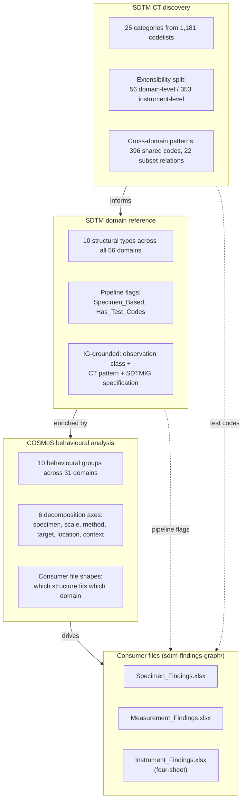

# SDTM Domain Overview — Three Analytical Layers

*How 56 SDTM domains are structured, classified, and consumed — and why it takes three analytical layers to make this machine-actionable.*

| | |
|---|---|
| **Date** | March 2026 |
| **SDTMIG** | v3.4 / SDTM v2.0 |
| **Repository** | [cdisc-for-ai](https://github.com/kerfors/cdisc-for-ai) |

---

## Why this document

SDTM classifies domains by observation class — Findings, Events, Interventions, Special-Purpose, Trial Design. This tells you *what kind of observation* a domain holds, not *how the data is architecturally structured* or *how a consumer should build files and queries for it*.

This repository approaches the problem through three analytical layers, each asking a different question. The domain code is the join key across all three.

---

## The three layers

**Layer 1 — SDTM CT discovery.** Bottom-up analysis of 1,181 codelists from NCI EVS. Discovers 25 structural categories through inductive clustering. Key finding: the extensibility flag separates domain-level (56 extensible) from instrument-level (353 non-extensible) test codes. Also reveals undeclared structure: shared codes, subset relationships, TC↔TN pairing. *Adds: CT architecture.*

**Layer 2 — SDTM domain reference.** Combines CT patterns with SDTMIG specification (observation classes, Section 6.3.5 grouping, variable patterns) to classify all 56 domains into 10 structural types. Produces pipeline flags (`Specimen_Based`, `Has_Test_Codes`) consumed by notebooks. Covers every domain including the 25 without COSMoS content. *Adds: domain identity — stable classification for pipeline logic.*

**Layer 3 — COSMoS behavioural analysis.** Analyses actual BC→DSS content — ratios, fan-out patterns, column population, decomposition axes — across the 31 domains with COSMoS content. Discovers that some structural types are too coarse for consumer logic: "Specimen-based Findings" contains three distinct patterns (LB by specimen, IS by target antigen, GF by result scale). *Adds: consumer logic — which file structure fits which domain.*

### Artifacts by layer

| Layer | Documents | Machine-actionable outputs |
|---|---|---|
| CT discovery | [SDTM_Test_Codes_Summary.md](sdtm-test-codes/docs/SDTM_Test_Codes_Summary.md), [CT_Category_Profiles.md](skills/sdtm-ct-analysis/SDTM_CT_Category_Profiles.md), [NCIt_Instrument_Identity_Findings.md](sdtm-test-codes/docs/NCIt_Instrument_Identity_Findings.md) | [SDTM_Test_Identity.xlsx](sdtm-test-codes/machine_actionable/), [SDTM_Instrument_Test_Identity.xlsx](sdtm-test-codes/machine_actionable/), [SDTM_Instrument_Identity.xlsx](sdtm-test-codes/machine_actionable/) |
| Domain reference | This document | [SDTM_Domain_Metadata.xlsx](sdtm-domain-reference/machine_actionable/) |
| Behavioural analysis | [COSMoS_Behavioural_Analysis.md](cosmos-bc-dss/docs/COSMoS_Behavioural_Analysis.md), [COSMoS_Content_and_QC.md](cosmos-bc-dss/docs/COSMoS_Content_and_QC.md) | [COSMoS_Domain_Pattern_Inventory.xlsx](cosmos-bc-dss/docs/), [COSMoS_BC_DSS.xlsx](cosmos-bc-dss/interim/) |

---

## Two classifications, one join

The two classification systems coexist. Structural Type is a column in `SDTM_Domain_Metadata.xlsx`. Behavioural Group is a column in `COSMoS_Domain_Pattern_Inventory.xlsx`.

**Structural Type** (Layer 2) — IG-grounded. All 56 domains. Stable across COSMoS releases.

**Behavioural Group** (Layer 3) — COSMoS-empirical. 31 domains. Evolves as COSMoS publishes new content.

They agree for most groups. They diverge within "Specimen-based Findings" (11 domains), which the behavioural analysis splits into three:

| Behavioural Group | Domains | Primary axis | Why distinct |
|---|---|---|---|
| Specimen Findings | LB, MB, MI, CP, BS, MS, PC, PP | Specimen | Same TESTCD measured in different body fluids |
| Immunogenicity Findings | IS | Target/Analyte | Specimen is constant; fan-out by antigen (up to 92:1) |
| Genomics Findings | GF | Result Scale | Scale-driven; specimen encoded as NCIt codes |

UR is reclassified from Specimen-based to Domain-specific Findings — behaviourally flat despite its IG classification.

---

## 10 structural types (all 56 domains)

| Structural Type | Domains | Key Characteristic |
|---|---|---|
| Specimen-based Findings | LB, IS, GF, MB, MI, MS, BS, CP, PC, PP, UR | --SPEC variable; SDTMIG Section 6.3.5 |
| Instrument Findings | QS, FT, RS | Non-extensible codelists; BC hierarchy |
| Measurement Findings | VS, EG, MK, CV | Subject-level measurements; no specimen |
| Domain-specific Findings | DA, DD, RP, SC, SR, SS | Domain-specific observation patterns |
| Clinical Assessment Findings | FA, TR, TU, IE | Findings about events/interventions; RELREC |
| Events | AE, DS, MH, CE, BE, DV, HO | One occurrence per record |
| Interventions | CM, EX, EC, PR, SU, ML, AG | One treatment/exposure per record |
| Special-Purpose | CO, DM, SE, SM, SV | Fixed-structure domains |
| Trial Design | TA, TD, TE, TI, TS, TV, VE | Study-level metadata |
| Relationship | RELREC, RELSPEC | Inter-record linkage |

## 10 behavioural groups (31 domains with COSMoS content)

Full detail in [COSMoS_Behavioural_Analysis.md](cosmos-bc-dss/docs/COSMoS_Behavioural_Analysis.md) and [COSMoS_Domain_Pattern_Inventory.xlsx](cosmos-bc-dss/docs/COSMoS_Domain_Pattern_Inventory.xlsx).

| Behavioural Group | Domains | Row semantics | Consumer file shape |
|---|---|---|---|
| Specimen Findings | LB, MB, MI, CP, BS, MS, PC, PP | TESTCD x specimen x scale | Two sheets: Test_Identity + Measurement_Specs |
| Immunogenicity Findings | IS | Antibody class × target × scale | Own structure needed |
| Genomics Findings | GF | Assessment × scale × method | Two-sheet possible, different axis |
| Measurement Findings | VS, EG, MK, CV | Subject-level measurement | Two sheets (VS, MK, CV). EG deferred. |
| Instrument Findings | QS, FT, RS | Question within instrument | Four sheets: Test_Identity + Measurement_Specs + BC_Categories + BC_Parents |
| Domain-specific Findings | DD, RP, SC, SR, UR | Domain-specific assessment | Single sheet |
| Clinical Assessment | FA, TR, TU, IE | Finding about event/intervention | Single sheet + RELREC |
| Events | AE, DS, MH, BE | Event type or prespecified variant | Single sheet |
| Interventions | CM, EX, EC, PR, SU | Intervention or subtype | Single sheet |
| Trial Design | TS | Study-level parameter | Out of scope for subject-level |

---

## Key findings

**Specimen-based Findings are where the two-level model works.** The COSMoS BC→DSS relationship does real decomposition here. But "specimen-based" is not one pattern — three distinct decomposition logics exist within this structural type.

**Instrument Findings use the BC hierarchy differently.** BC→DSS is 1:1. The contribution is the hierarchy: instrument → subscale → question grouping that SDTM CT does not declare.

**The Findings class hides architectural diversity.** 22 of 56 domains are Findings, spanning six behavioural groups — from 8-way specimen decomposition to flat 1:1 assessments.

**Events and Interventions have context-driven fan-out.** BC→DSS encodes protocol decisions ("what does the protocol care about?"), not measurement decomposition ("how is this measured?").

---

## Sources

**Domain list and observation classes:** SDTMIG v3.4 public documentation. **CT discovery:** NCI EVS SDTM Terminology (2025-09-26). **Structural types:** Our analysis — CT categories + SDTMIG specification + observation class. **Behavioural groups:** COSMoS public exports — flattened BC/DSS content patterns. **Not included:** SDTM v2.0 variable-level metadata (requires CDISC membership). SDTM v3.0 (under review).

## About

Exploratory work built with AI assistance. Not an official CDISC product. Part of [cdisc-for-ai](https://github.com/kerfors/cdisc-for-ai).
