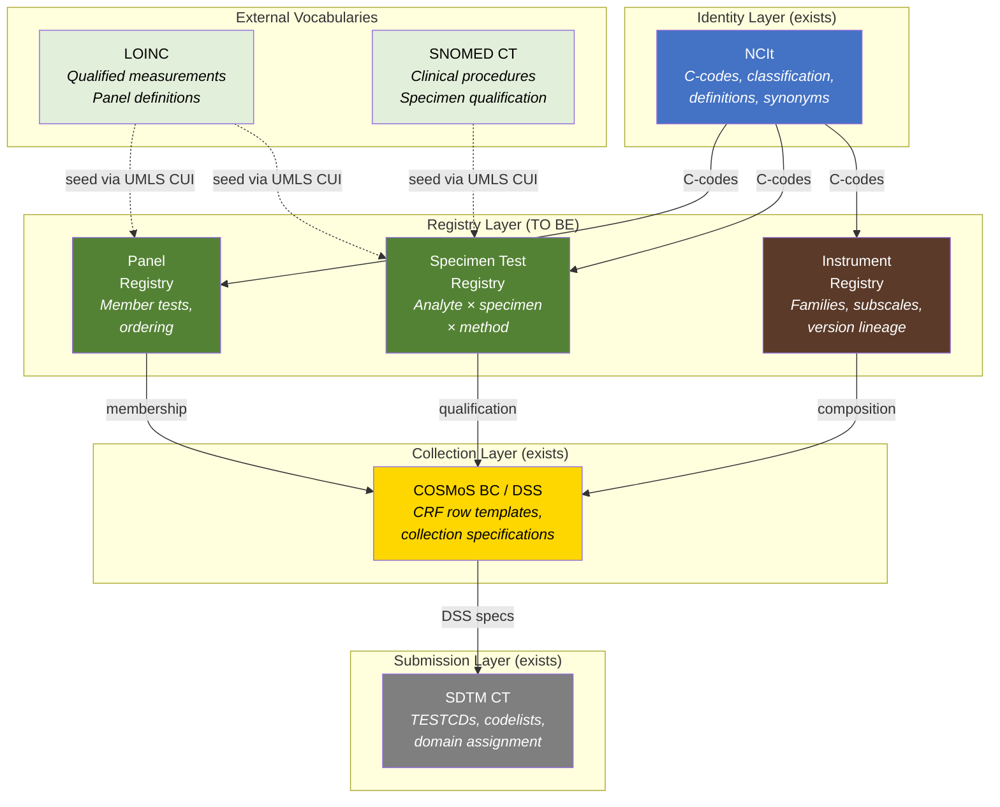

# The Registry Gap: What the Instrument Probe Reveals About CDISC's Missing Middle Layer

## Context

The `coa-structure` probe walks the NCIt hierarchy to resolve instrument-level
identity for SDTM TESTCD codelists in the QS, FT, and RS domains. The probe
enriches all levels — instrument, question container, individual question — with
NCIt definitions, synonyms, and UMLS CUIs.

This analysis documents what the probe found about the structural limitations of
the current standards, and how those limitations apply equally to specimen-based
Findings domains.

## What NCIt provides

NCIt assigns stable C-codes to individual concepts and organises them in is-a
(classification) hierarchies. For instruments:

- **C20993** (Research or Clinical Assessment Tool) — 2,208 descendants across
  4 depth levels. These are classification categories, not composition layers.
  Depth-1 children include generic buckets like "Clinical or Research Assessment
  Questionnaire" (492 children) alongside specific instruments.

- **C211913** (Question Container) — 365 direct children, each a 1:1 wrapper
  around a TESTCD codelist. No instrument has multiple containers. The container
  level could have modeled subscales but was implemented as classification.

The two trees are completely disjoint (zero overlap). The probe links them
through TESTCD question concepts that are descendants of C211913 containers and
members of codelists that map to C20993 instruments.

## What NCIt does not provide

NCIt models **classification** (what kind of thing is this?) but not
**composition** (what is this made of?). Specifically:

**No instrument families.** FACT-G, FACT-B, FACT-L, and FACT-P are all flat
siblings under C91105. NCIt does not model that FACT-B = FACT-G + Breast Cancer
Concern subscale. The 77 FACT-related concepts are all at the same depth with no
compositional relationships between them.

**No subscale structure.** Real instruments have subscales (PHQ-9 somatic vs
cognitive items, PANSS Positive/Negative/General, SF-36's 8 domains). These are
not represented. Each instrument maps to exactly one Question Container.

**No version lineage.** FACT-B v3 and FACT-B v4 are separate C-codes with no
explicit version relationship.

**Classification depth ≠ composition depth.** A depth-3 concept is not "part of"
its depth-2 parent in any clinical sense. The hierarchy means "is a kind of",
not "is composed of".

## The same gap exists for specimen-based domains

The instrument finding is not unique. For specimen-based Findings:

- NCIt has a C-code for **Glucose** (the analyte) and a C-code for **Serum**
  (the specimen), but no concept for **Glucose in Serum, Quantitative** — the
  specific qualified measurement.

- The combination of analyte × specimen × method is what defines a measurement,
  but NCIt models each axis independently.

- There are no C-codes within CDISC scope for the qualified measurement concepts
  that LOINC provides (e.g., LOINC 2345-7 = Glucose [Mass/volume] in Serum or
  Plasma).

NCIt provides classification in both cases. The decomposition/composition layer
is missing in both.

## The three composition patterns

Three distinct structural types in Findings domains each need a composition
layer, and each has a different decomposition logic:

### 1. Instrument composition

Instrument → subscales → individual questions.

Example: FACT-B v4 = FACT-G core (Physical + Social + Emotional + Functional
well-being subscales, 27 items) + Breast Cancer Concern subscale (10 items).

What exists today: NCIt C-codes per instrument and per question. COSMoS DSSs for
collection specification. No subscale decomposition, no instrument family
relationships, no version lineage.

### 2. Specimen test qualification

Analyte × specimen × method → qualified measurement concept.

Example: Glucose × Serum × Quantitative → a specific orderable/reportable test.

What exists today: NCIt C-codes per analyte and per specimen (independently).
COSMoS DSSs that combine them for collection. No qualified measurement concept
with its own stable identifier within CDISC scope.

### 3. Panel composition

Panel → member tests (with ordering, required/optional flags).

Example: Basic Metabolic Panel → Glucose, BUN, Creatinine, Sodium, Potassium,
CO2, Chloride, Calcium.

What exists today: Nothing within CDISC scope. LOINC has panel definitions.
SDTM has no panel-level concept.

## Where COSMoS fits

COSMoS Biomedical Concepts and Dataset Specializations were architecturally
positioned to fill this gap. In practice:

- **BCs model collection templates**, not measurement ontology. A DSS is a CRF
  row template specifying how to capture and store a value.

- **BC identity is unstable.** DS_Codes are mnemonics, not governed identifiers.
  They are not unique across domains.

- **Composition is not modeled.** No part-of relationships between BCs. The
  Categories field (semicolon-separated labels) provides editorial grouping
  strings without identifiers.

- **Coverage is thin.** 104 DSSs vs 4,183 TESTCDs (2.5% coverage).

COSMoS addresses the collection specification need but does not provide the
registry/composition layer.

## Architecture overview

The dashed lines show the seeding path: UMLS CUIs on NCIt concepts bridge to
LOINC and SNOMED, which already have the composition semantics that the
registries need. Solid lines show the intended data flow between layers.

## The registry need

All three composition patterns point to the same architectural gap: a **registry
layer** between NCIt (identity/classification) and COSMoS (collection
specification) that owns:

- **Stable identifiers** for composed concepts (qualified measurements, instrument
  families, panels)
- **Composition relationships** (part-of, member-of, qualified-by)
- **Version management** (supersedes, derives-from)
- **Cross-references** upward to NCIt C-codes and outward to UMLS/LOINC/SNOMED

One registry, three composition patterns. The structural type (from SDTM Domain
Metadata) determines which decomposition pattern applies.

## Seeding path

The probe demonstrates that existing standards data can seed these registries:

1. **NCIt C-codes** provide the CDISC-scoped identity layer (definitions,
   synonyms, classification).

2. **UMLS CUIs** bridge to external vocabularies. The probe found UMLS CUIs on
   ~30% of instrument concepts and ~40% of container concepts. The green track
   found ~30% coverage for TESTCDs.

3. **LOINC** (reachable via UMLS CUIs) already has qualified measurement
   concepts and panel definitions — the composition that CDISC lacks.

4. **SNOMED CT** (also via UMLS) has clinical procedure and specimen
   qualification relationships.

The seeding is an automation problem. The ongoing governance — who decides what
gets added, how updates flow across release schedules, how conflicts between
source vocabularies are resolved — is an organisational problem that requires
CDISC ownership.

## What this repo provides

The `cdisc-for-ai` repository makes the current state machine-readable:

- **Green track** (`sdtm-test-codes/`): 4,183 TESTCDs with NCIt identity,
  UMLS CUIs, and definitions. The individual question level.

- **Brown track** (`coa-structure/`): 359 instrument TESTCD codelists mapped to
  their NCIt instrument and container parents, enriched at all levels. The
  instrument hierarchy level.

- **Yellow layer** (`cosmos-bc-dss/`): COSMoS BC and DSS data flattened for
  machine use. The collection specification level.

- **Consumer files** (`sdtm-findings/`): Joined outputs per structural type.

These flat files are today's delivery format. The long-term destination is a
traversable graph — which is essentially the registry described above.

## Evidence summary

| Aspect | Instruments | Specimen tests | Panels |
|---|---|---|---|
| NCIt identity | C-code per instrument, per question | C-code per analyte, per specimen | None |
| NCIt composition | None (classification only) | None (axes independent) | None |
| COSMoS coverage | 104 DSSs / 359 codelists | Partial DSS coverage | None |
| UMLS bridge | ~30% instruments have CUIs | ~30% TESTCDs have CUIs | Via LOINC |
| Composition source | Not modeled anywhere | LOINC has qualified concepts | LOINC has panels |
| Registry exists? | No | No | No |

---

*Generated from the `explore/coa-structure` branch probe analysis, April 2026.*
*SDTM CT 2026-03-27, COSMoS 2026-Q1, NCIt Thesaurus.FLAT.*
