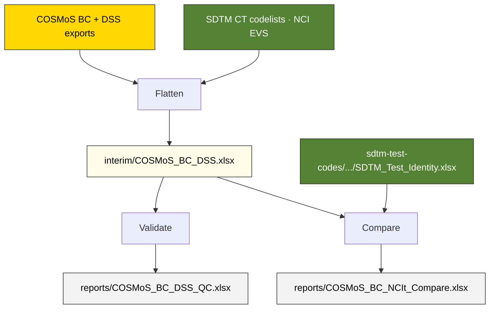

# cosmos-bc-dss — How is it measured?

The yellow layer. Every COSMoS measurement specification flattened into a single row: what biomedical concept it belongs to, what specimen/method/scale it requires, and how it maps to SDTM variables. Covers all SDTM domains, not just Laboratory.

**Current output:** [`interim/COSMoS_BC_DSS.xlsx`](interim/COSMoS_BC_DSS.xlsx) — structurally complete, validated. Column naming follows COSMoS vocabulary with minor clarifications for machine consumption.

Two companion documents cover what the notebooks produce and what the analysis reveals:

- [`docs/COSMoS_Content_and_QC.md`](docs/COSMoS_Content_and_QC.md) — what the interim file contains, domain distribution, the Glucose example showing one BC producing eight DSSs, and a summary of all QC findings.
- [`docs/COSMoS_Behavioural_Analysis.md`](docs/COSMoS_Behavioural_Analysis.md) — how BC→DSS patterns differ across domains, ten behavioural groups, six decomposition axes.

## Notebooks

| Notebook | Role | Output |
|---|---|---|
| [`COSMoS_BC_DSS_Flatten`](notebooks/COSMoS_BC_DSS_Flatten.ipynb) | Flatten | [`interim/COSMoS_BC_DSS.xlsx`](interim/COSMoS_BC_DSS.xlsx) |
| [`COSMoS_BC_DSS_Validate`](notebooks/COSMoS_BC_DSS_Validate.ipynb) | Validate | [`reports/COSMoS_BC_DSS_QC.xlsx`](reports/COSMoS_BC_DSS_QC.xlsx) |
| [`COSMoS_BC_NCIt_Compare`](notebooks/COSMoS_BC_NCIt_Compare.ipynb) | Compare | [`reports/COSMoS_BC_NCIt_Compare.xlsx`](reports/COSMoS_BC_NCIt_Compare.xlsx) |

**Flatten** downloads COSMoS BC and DSS exports, resolves SDTM CT submission values for specimen/method/unit, classifies BCs by type, and builds hierarchy paths. Extracts DSS dimensions generically by variable role — no hardcoded domain logic.

**Validate** runs 17 quality checks (QC-01 to QC-15) on the interim file — structural integrity plus validation against the [BC Curation Principles and Completion Guidelines](https://cdisc-org.github.io/COSMoS/bc_starter_package/doc/BC%20Curation%20Principles%20and%20Completion%20GLs.xlsx). Reads only from the interim file — no source re-download needed.

**Compare** validates COSMoS BC definitions and synonyms against the authoritative NCIt source (via [`SDTM_Test_Identity.xlsx`](../sdtm-test-codes/machine_actionable/SDTM_Test_Identity.xlsx)). Scoped to subject-level Findings BCs. Reads from both the interim file and the green track output.

Each notebook documents its own logic, sources, and design decisions in detail.

## Data flow

All source files are downloaded automatically and cached in [`downloads/`](downloads/).

## Downstream

The interim file feeds the [`sdtm-findings`](../sdtm-findings/) consumption track, which joins green (SDTM Test Identity) and yellow (COSMoS BC/DSS) into domain-specific consumer files: [`Specimen_Findings.xlsx`](../sdtm-findings/machine_actionable/Specimen_Findings.xlsx) and [`Measurement_Findings.xlsx`](../sdtm-findings/machine_actionable/Measurement_Findings.xlsx). These are the reference files consumed by the [`specimen-findings-ct-mapping`](../skills/specimen-findings-ct-mapping/) skill.

## Dependencies

Flatten reads SDTM CT codelists from NCI EVS for submission value resolution. Validate reads only from the interim file. Compare reads the interim file and [`sdtm-test-codes/machine_actionable/SDTM_Test_Identity.xlsx`](../sdtm-test-codes/machine_actionable/SDTM_Test_Identity.xlsx) — the cross-track dependency.
