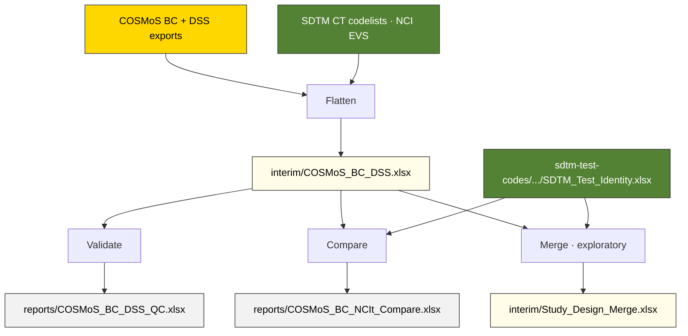

# cosmos-bc-dss — How is it measured?

The yellow layer. Every COSMoS measurement specification flattened into a single row: what biomedical concept it belongs to, what specimen/method/scale it requires, and how it maps to SDTM variables. Covers all SDTM domains, not just Laboratory.

**Current output:** [`interim/COSMoS_BC_DSS.xlsx`](interim/COSMoS_BC_DSS.xlsx) — structurally complete, validated. Column naming not yet finalized — see [`docs/COSMoS_Study_Design_Questions.md`](docs/COSMoS_Study_Design_Questions.md) for open questions.

Two companion documents cover what the notebooks produce and what remains open:

- [`docs/COSMoS_Content_and_QC.md`](docs/COSMoS_Content_and_QC.md) — what the interim file contains, domain distribution, the Glucose example showing one BC producing eight DSSs, and a summary of all QC findings.
- [`docs/COSMoS_Study_Design_Questions.md`](docs/COSMoS_Study_Design_Questions.md) — open questions on column naming (COSMoS vocabulary vs. study-design-friendly names) and whether DS codes should become formal persistent identifiers.

## Notebooks

| Notebook | Role | Output |
|---|---|---|
| [`COSMoS_BC_DSS_Flatten`](notebooks/COSMoS_BC_DSS_Flatten.ipynb) | Flatten | [`interim/COSMoS_BC_DSS.xlsx`](interim/COSMoS_BC_DSS.xlsx) |
| [`COSMoS_BC_DSS_Validate`](notebooks/COSMoS_BC_DSS_Validate.ipynb) | Validate | [`reports/COSMoS_BC_DSS_QC.xlsx`](reports/COSMoS_BC_DSS_QC.xlsx) |
| [`COSMoS_BC_NCIt_Compare`](notebooks/COSMoS_BC_NCIt_Compare.ipynb) | Compare | [`reports/COSMoS_BC_NCIt_Compare.xlsx`](reports/COSMoS_BC_NCIt_Compare.xlsx) |
| [`Study_Design_Merge`](notebooks/Study_Design_Merge.ipynb) | Merge | [`interim/Study_Design_Merge.xlsx`](interim/Study_Design_Merge.xlsx) |

**Flatten** downloads COSMoS BC and DSS exports, resolves SDTM CT submission values for specimen/method/unit, classifies BCs by type, and builds hierarchy paths. Extracts DSS dimensions generically by variable role — no hardcoded domain logic.

**Validate** runs 17 quality checks (QC-01 to QC-15) on the interim file — structural integrity plus validation against the [BC Curation Principles and Completion Guidelines](https://cdisc-org.github.io/COSMoS/bc_starter_package/doc/BC%20Curation%20Principles%20and%20Completion%20GLs.xlsx). Reads only from the interim file — no source re-download needed.

**Compare** validates COSMoS BC definitions and synonyms against the authoritative NCIt source (via [`SDTM_Test_Identity.xlsx`](../sdtm-test-codes/machine_actionable/SDTM_Test_Identity.xlsx)). Scoped to subject-level Findings BCs. Reads from both the interim file and the green track output.

**Merge** *(exploratory)* joins green (SDTM Test Identity) and yellow (COSMoS BC/DSS) into a single two-sheet reference file — Test_Identity (one row per TESTCD) and Measurement_Specs (one row per DSS). Intended as the reference file for the [`specimen-findings-ct-mapping`](../skills/specimen-findings-ct-mapping/) skill. Draft — column naming and structure to be refined after CDISC community discussion.

Each notebook documents its own logic, sources, and design decisions in detail.

## Data flow

All source files are downloaded automatically and cached in [`downloads/`](downloads/).

## Dependencies

Flatten reads SDTM CT codelists from NCI EVS for submission value resolution. Validate reads only from the interim file. Compare and Merge both read the interim file and [`sdtm-test-codes/machine_actionable/SDTM_Test_Identity.xlsx`](../sdtm-test-codes/machine_actionable/SDTM_Test_Identity.xlsx) — the cross-track dependencies.
