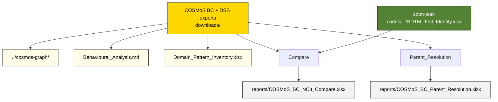

# cosmos-bc-dss — COSMoS source-ingest, behavioural analysis, NCIt comparison

The yellow layer. Originally the home of the legacy COSMoS BC/DSS single-sheet flatten; that role moved to [`../cosmos-graph/`](../cosmos-graph/) (schema-driven multi-sheet projection) and the flatten was retired in May 2026.

What stays here:

- **The COSMoS source-ingest landing zone.** [`downloads/`](downloads/) holds the COSMoS BC and DSS exports; both `cosmos-graph/` and the remaining notebooks below read from here.
- **Behavioural-analysis documentation.** Cross-domain analyses of how BC→DSS patterns vary by domain. The graph projection makes the data traversable; these docs explain how it behaves.
- **NCIt-comparison thread.** Notebooks and reports comparing COSMoS BC content against the authoritative NCIt source.

## Documents

- [`docs/COSMoS_Behavioural_Analysis.md`](docs/COSMoS_Behavioural_Analysis.md) — how BC→DSS patterns differ across domains, ten behavioural groups, six decomposition axes.
- [`docs/COSMoS_Content_and_QC.md`](docs/COSMoS_Content_and_QC.md) — what COSMoS publishes, domain distribution, the Glucose example showing one BC producing eight DSSs, summary of QC findings.
- [`docs/COSMoS_Collection_vs_Ontology.md`](docs/COSMoS_Collection_vs_Ontology.md) — why DSSs model collection templates, not medical ontology.
- [`docs/COSMoS_Specification_Focus.md`](docs/COSMoS_Specification_Focus.md) — where COSMoS specification value concentrates (DSS vs CRF).
- [`docs/COSMoS_Domain_Pattern_Inventory.xlsx`](docs/COSMoS_Domain_Pattern_Inventory.xlsx) — domain-by-domain behavioural-group classification.

## Notebooks

| Notebook | Role | Output |
|---|---|---|
| [`COSMoS_BC_NCIt_Compare`](notebooks/COSMoS_BC_NCIt_Compare.ipynb) | Compare COSMoS BC definitions and synonyms against authoritative NCIt | [`reports/COSMoS_BC_NCIt_Compare.xlsx`](reports/COSMoS_BC_NCIt_Compare.xlsx) |
| [`COSMoS_BC_NCIt_Source_Probe`](notebooks/COSMoS_BC_NCIt_Source_Probe.ipynb) | Probe NCIt source endpoints used by Compare | [`reports/COSMoS_BC_NCIt_Source_Probe.xlsx`](reports/COSMoS_BC_NCIt_Source_Probe.xlsx) |
| [`COSMoS_BC_Parent_Resolution`](notebooks/COSMoS_BC_Parent_Resolution.ipynb) | Resolve BC parent chains in the source | [`reports/COSMoS_BC_Parent_Resolution.xlsx`](reports/COSMoS_BC_Parent_Resolution.xlsx) |
| [`COSMoS_Observable_Derivation`](notebooks/COSMoS_Observable_Derivation.ipynb) | Derive observables (component × system × scale × method) from the graph; how many each BC hides, DSS grain vs observable grain | [`reports/COSMoS_Observable_Derivation.xlsx`](reports/COSMoS_Observable_Derivation.xlsx) |
| [`COSMoS_Observable_LOINC_Check`](notebooks/COSMoS_Observable_LOINC_Check.ipynb) | Validate derived observable axes against LOINC's own (XML4Pharma LOINC services); glucose family completeness | [`reports/COSMoS_Observable_LOINC_Check.xlsx`](reports/COSMoS_Observable_LOINC_Check.xlsx) |

**Compare** scoped to subject-level Findings BCs. Reads COSMoS exports from [`downloads/`](downloads/) and the green-track [`SDTM_Test_Identity.xlsx`](../sdtm-test-codes/machine_actionable/SDTM_Test_Identity.xlsx) for NCIt anchors.

**Source_Probe** caches NCIt source-endpoint responses to [`cache/ncit_source_probe.json`](cache/ncit_source_probe.json) so Compare can run repeatedly without re-querying NCIt.

**Parent_Resolution** traces parent-of relationships in BC content.

**Observable_Derivation** reads the graph projection ([`../cosmos-graph/interim/COSMoS_Graph.xlsx`](../cosmos-graph/interim/COSMoS_Graph.xlsx)), not the downloads. Companion to [`docs/Glucose_Siblings_BC_DSS_Proposal.html`](docs/Glucose_Siblings_BC_DSS_Proposal.html); uses only LOINC codes pinned in the package, no external lookup.

**Observable_LOINC_Check** compares the derived axes against LOINC's parts per pinned code, via [Jozef Aerts' XML4Pharma LOINC web services](http://xml4pharmaserver.com/WebServices/LOINC_webservices.html) (plain HTTP, port 8080). Cache-first: responses live in [`cache/loinc_service_cache.json`](cache/loinc_service_cache.json) (LOINC v2.82, fetched 2026-08-24) so the notebook runs without network; missing codes are fetched live and cached.

## Data flow

```mermaid
graph TD
    A[COSMoS BC + DSS exports<br/>downloads/] --> CG[../cosmos-graph/]
    A --> BA[Behavioural_Analysis.md]
    A --> DPI[Domain_Pattern_Inventory.xlsx]
    A --> CMP[Compare]
    G[sdtm-test-codes/.../SDTM_Test_Identity.xlsx] --> CMP
    CMP --> CR[reports/COSMoS_BC_NCIt_Compare.xlsx]
    A --> PR[Parent_Resolution]
    PR --> PRR[reports/COSMoS_BC_Parent_Resolution.xlsx]

    style A fill:#FFD700,stroke:#333,color:#000
    style G fill:#548235,stroke:#333,color:#fff
    style CG fill:#FFFCE8,stroke:#333,color:#000
    style BA fill:#FFFCE8,stroke:#333,color:#000
    style DPI fill:#FFFCE8,stroke:#333,color:#000
    style CR fill:#f2f2f2,stroke:#333,color:#000
    style PRR fill:#f2f2f2,stroke:#333,color:#000
```

All source files are downloaded automatically and cached in [`downloads/`](downloads/).

## Downstream

The COSMoS source ingest serves [`cosmos-graph/`](../cosmos-graph/), which projects the same source into a multi-sheet traversable graph driven by the LinkML schema. Consumer tracks (`consumer-bases/`, `sdtm-findings-graph/`) read from the graph, not from this track.

## Historical note

Earlier releases produced a single-sheet flatten at `interim/COSMoS_BC_DSS.xlsx` and a `Validate` QC notebook. Both retired May 2026 — see [`../docs/Changes_2026-05.md`](../docs/Changes_2026-05.md). Earlier versions remain in git history.
