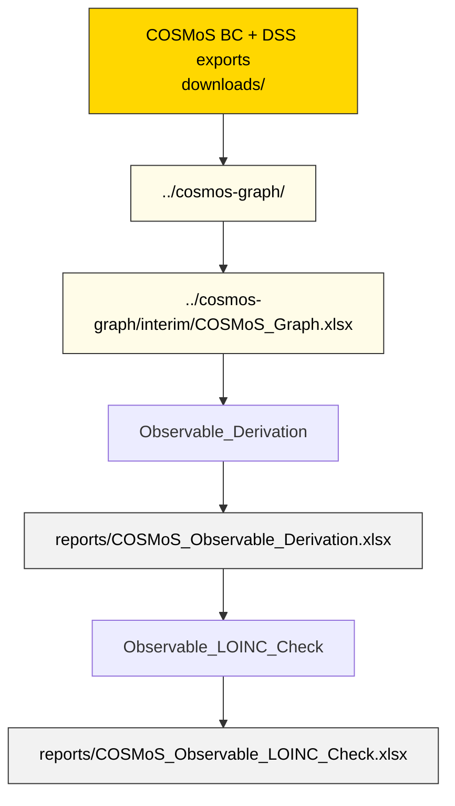

# cosmos-bc-dss — COSMoS source-ingest and observables

The yellow layer. Originally the home of the legacy COSMoS BC/DSS single-sheet flatten; that role moved to [`../cosmos-graph/`](../cosmos-graph/) (schema-driven multi-sheet projection) and the flatten was retired in May 2026.

What stays here:

- **The COSMoS source-ingest landing zone.** [`downloads/`](downloads/) holds the COSMoS BC and DSS exports; both `cosmos-graph/` and the remaining notebooks below read from here.
- **Behavioural-analysis documentation.** The March 2026 cross-domain analysis of how BC→DSS patterns vary by domain is archived in [`../docs/archive/behavioural-analysis-2026-03/`](../docs/archive/behavioural-analysis-2026-03/). What remains here is later, exploratory work.
- **Observables and qualified-BC sketches.** Notebooks that derive observables from the graph and check them against LOINC; the sibling-BC sketches in [`sibling-bc/`](sibling-bc/) and [`dds/`](dds/).

The April 2026 NCIt-comparison notebooks, which read the retired flatten, are archived in [`archive/ncit-comparison-2026-04/`](archive/ncit-comparison-2026-04/).

## Documents

- [`docs/COSMoS_Content_and_QC.md`](docs/COSMoS_Content_and_QC.md) — what COSMoS publishes, domain distribution, the Glucose example showing one BC producing eight DSSs, summary of QC findings.
- [`docs/COSMoS_Specification_Focus.md`](docs/COSMoS_Specification_Focus.md) — where COSMoS specification value concentrates (DSS vs CRF).

## Notebooks

| Notebook | Role | Output |
|---|---|---|
| [`COSMoS_Observable_Derivation`](notebooks/COSMoS_Observable_Derivation.ipynb) | Derive observables (component × system × scale × method) from the graph; how many each BC hides, DSS grain vs observable grain | [`reports/COSMoS_Observable_Derivation.xlsx`](reports/COSMoS_Observable_Derivation.xlsx) |
| [`COSMoS_Observable_LOINC_Check`](notebooks/COSMoS_Observable_LOINC_Check.ipynb) | Validate derived observable axes against LOINC's own (XML4Pharma LOINC services); glucose family completeness | [`reports/COSMoS_Observable_LOINC_Check.xlsx`](reports/COSMoS_Observable_LOINC_Check.xlsx) |

**Observable_Derivation** reads the graph projection ([`../cosmos-graph/interim/COSMoS_Graph.xlsx`](../cosmos-graph/interim/COSMoS_Graph.xlsx)), not the downloads. Companion to [`docs/Glucose_Siblings_BC_DSS_Proposal.html`](docs/Glucose_Siblings_BC_DSS_Proposal.html); uses only LOINC codes pinned in the package, no external lookup.

**Observable_LOINC_Check** compares the derived axes against LOINC's parts per pinned code, via [Jozef Aerts' XML4Pharma LOINC web services](http://xml4pharmaserver.com/WebServices/LOINC_webservices.html) (plain HTTP, port 8080). Cache-first: responses live in [`cache/loinc_service_cache.json`](cache/loinc_service_cache.json) (LOINC v2.82, fetched 2026-08-24) so the notebook runs without network; missing codes are fetched live and cached.

## Data flow

```mermaid
graph TD
    A[COSMoS BC + DSS exports<br/>downloads/] --> CG[../cosmos-graph/]
    CG --> GX[../cosmos-graph/interim/COSMoS_Graph.xlsx]
    GX --> OD[Observable_Derivation]
    OD --> ODR[reports/COSMoS_Observable_Derivation.xlsx]
    ODR --> OL[Observable_LOINC_Check]
    OL --> OLR[reports/COSMoS_Observable_LOINC_Check.xlsx]

    style A fill:#FFD700,stroke:#333,color:#000
    style CG fill:#FFFCE8,stroke:#333,color:#000
    style GX fill:#FFFCE8,stroke:#333,color:#000
    style ODR fill:#f2f2f2,stroke:#333,color:#000
    style OLR fill:#f2f2f2,stroke:#333,color:#000
```

All source files are downloaded automatically and cached in [`downloads/`](downloads/).

## Downstream

The COSMoS source ingest serves [`cosmos-graph/`](../cosmos-graph/), which projects the same source into a multi-sheet traversable graph driven by the LinkML schema. Consumer tracks (`consumer-bases/`, `sdtm-findings-graph/`) read from the graph, not from this track.

## Historical note

Earlier releases produced a single-sheet flatten at `interim/COSMoS_BC_DSS.xlsx` and a `Validate` QC notebook. Both retired May 2026 — see [`../docs/Changes_2026-05.md`](../docs/Changes_2026-05.md). Earlier versions remain in git history.
