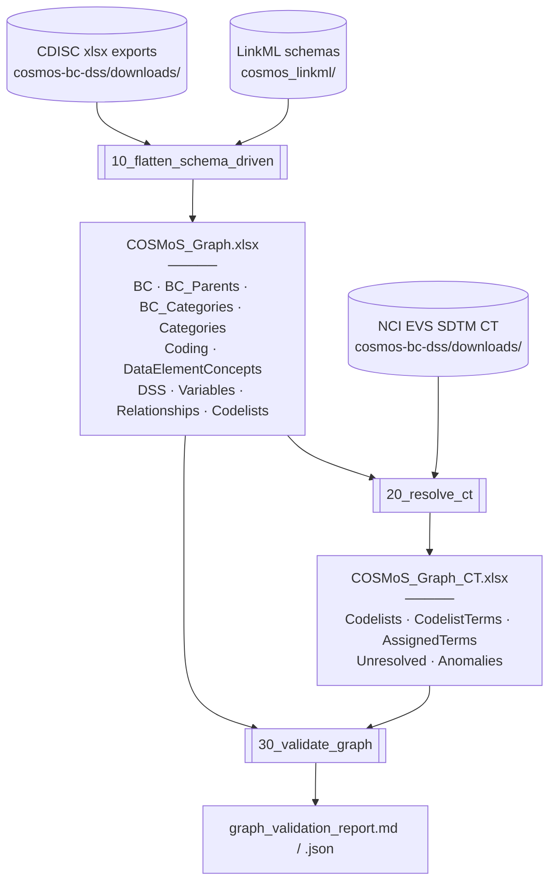

# COSMoS Graph — track reference

*The cosmos-graph track: what it carries, how it is built, how to read it. Supersedes the five pre-2026-04 design records (Step 1 close, Step 2 scoping, Step 2 as-built, Step 2→3 hand-off, 2026-04-23 triage), retained under [`archive/`](archive/).*

*cdisc-for-ai, package 2026-Q1.*



---

## 1. What CDISC publishes

COSMoS is authored at `cdisc-org/COSMoS` on GitHub. Four folders matter.

- `model/` — three LinkML schema files (`cosmos_bc_model.yaml`, `cosmos_sdtm_model.yaml`, `cosmos_crf_model.yaml`). Authoritative class definitions for Biomedical Concepts, SDTM Dataset Specializations, and CRF Specializations.
- `yaml/` — LinkML-conformant instance data, one file per concept node. As of package 2026-Q1 the YAML folder covers only 5 of 32 SDTM domains (RE, VS, DS, LB, GF); CRF instances exist only in the draft package.
- `openapi/` — OpenAPI specs auto-generated from the LinkML schemas. Describes the CDISC Library API.
- `export/` — flat Excel and CSV exports of the full graph. Graph-equivalent to the YAML at VLM-row grain (0 unmapped columns, see §5).

The LinkML schema is authoritative. Everything else is derived. The cosmos-graph flattener reads the xlsx export because it is the only published serialisation with full domain coverage today.

## 2. The authored graph

Three root classes, one per schema.

- `BiomedicalConcept` — NCIt-anchored concept with inlined `Coding` (external code systems) and `DataElementConcept` (internal decomposition into observable properties).
- `SDTMGroup` — one DSS. Identified by `datasetSpecializationId` (the DS_Code mnemonic). Pinned to a `source` variable (`<domain>.<variable>`, e.g. `VS.VSTESTCD`) and to a BC via `biomedicalConceptId`. Carries an inlined list of `SDTMVariable`.
- `CRFGroup` — one CRF specialisation. Out of scope for the current flattener; CRF instances not yet published in a released package.

Each `SDTMVariable` carries four reified child objects that encode the graph facts the old single-sheet flattener dropped.

- `relationship` — RDF-star-style edge: `subject`, `linkingPhrase` (natural-English, roughly 100 values), `predicateTerm` (programmatic type, roughly 30 values, e.g. `IS_DECODED_BY`, `IS_RESULT_OF`), `object`. Authored; no inference needed.
- `assignedTerm` — the NCIt-anchored pin: `conceptId` + `value`. The join key for cross-DSS concept traversal.
- `codelist` and `subsetCodelist` — the codelist binding with NCIt `conceptId`, `href`, and CDISC submission value.

Plus NCIt-anchored enumerations: `OriginTypeEnum` (C170449), `OriginSourceEnum` (C170450), `RoleEnum`, `ComparatorEnum`.

Minimal example, from `sdtm_abi.yaml`, VSTESTCD only:

```yaml
- name: VSTESTCD
  codelist:
    conceptId: C66741
    submissionValue: VSTESTCD
  assignedTerm:
    conceptId: C87304
    value: "ABI"
  role: Topic
  relationship:
    subject: VSTESTCD
    linkingPhrase: is the code for the value in
    predicateTerm: IS_DECODED_BY
    object: VSTEST
  mandatoryVariable: true
  mandatoryValue: true
  comparator: EQ
```

This is one DSS's pin of VSTESTCD to ABI (`C87304` Ankle-Brachial Index), with the reification quad attached. The identity-pin vs. qualifier-slot distinction is a structural fact here — readable from `mandatoryValue` + `comparator` — not inferred.

A full walkthrough of `sdtm_abi.yaml` is retained in [`archive/COSMoS_Graph_As_Authored.md`](archive/COSMoS_Graph_As_Authored.md) §5.

## 3. Graph sheets as built

Two interim workbooks, both regenerable from CDISC source + LinkML schemas + SDTM CT. No hand-authored content in either.

### `interim/COSMoS_Graph.xlsx` — core, lossless-over-source

| Sheet | Grain | Purpose |
|---|---|---|
| `ReadMe` | — | Provenance, column dictionary links. |
| `BC` | one per BC | BC-level identity: `bc_id`, `ncit_code`, `bc_short_name`, `bc_definition`, `bc_synonyms`, `bc_categories` (joined string), `bc_hierarchy_path` (joined string), `bc_parent_label`, `bc_type`, `result_scales`. Multi-value and inlined-child content is broken out into the BC-side edge and inline sheets below. |
| `BC_Parents` | one per edge | BC-to-BC parent relation as edge list. 3 columns: `bc_id`, `parent_bc_id`, `parent_bc_short_name`. Makes the BC hierarchy traversable without parsing `bc_hierarchy_path`. |
| `BC_Categories` | one per edge | BC-to-Category edges. 2 columns: `bc_id`, `category`. Normalised form of the semicolon-delimited `bc_categories` string on the BC sheet. |
| `Categories` | one per token | Controlled vocabulary of category tokens. Source: the xlsx `Categories` sheet. Every category used on a `BC_Categories` edge resolves to this vocabulary. |
| `Coding` | one per `(BC × external code)` | Projects the inlined `Coding` list from the LinkML `BiomedicalConcept` schema. 4 columns: `bc_id`, `system`, `system_name`, `code`. |
| `DataElementConcepts` | one per `(BC × DEC)` | Projects the inlined `DataElementConcept` list from the LinkML `BiomedicalConcept` schema. 6 columns: `bc_id`, `dec_id`, `ncit_dec_code`, `dec_label`, `data_type`, `example_set`. |
| `DSS` | one per DSS | DSS-level identity. 8 columns: `ds_id`, `bc_id`, `domain`, `source`, `ds_short_name`, `sdtmig_start_version`, `sdtmig_end_version`, `package_date`. |
| `Variables` | one per SDTMVariable | VLM-row grain. 26 columns — the LinkML slots on `SDTMVariable` plus the inlined reification quad. |
| `Relationships` | one per reified edge | Long-format. 6 columns: `ds_id`, `variable_name`, `subject`, `linking_phrase`, `predicate_term`, `object`. Rows without a quad in source are omitted. |
| `Codelists` | one per binding | Deduped `(codelist_concept_id, codelist_submission_value)` pairs, with `variable_uses_count`. |

### `interim/COSMoS_Graph_CT.xlsx` — NCI EVS SDTM CT enrichment

CT is a separate file so the core stays lossless-over-source and does not depend on the CT package version.

| Sheet | Grain | Purpose |
|---|---|---|
| `ReadMe` | — | Provenance, CT package version. |
| `Codelists` | one per bound codelist | Core `Codelists` enriched with `codelist_name`, `codelist_extensible`, NCI preferred term. |
| `CodelistTerms` | one per (codelist, term) pair | Permissible values expanded from SDTM CT. |
| `AssignedTerms` | one per unique assigned-term concept | NCI definition + preferred term for each pinned concept. |
| `Unresolved` | — | Concept IDs not found in the current CT package. |
| `Anomalies` | — | Pinned-term-not-in-bound-codelist cases. |

Per-sheet row counts from the 2026-04-22 Step 2 build are captured in [`archive/flattener_rewrite_audit.md`](archive/flattener_rewrite_audit.md) §2.2; current counts regenerate with each run of `30_validate_graph.ipynb`, surfacing in [`../reports/graph_validation_report.md`](../reports/graph_validation_report.md).

## 4. Architecture

**SchemaView-driven flatten.** The flattener reads the CDISC xlsx export and uses `linkml_runtime.SchemaView` over `cosmos_sdtm_model.yaml` and `cosmos_bc_model.yaml` to project into sheets. Class and slot metadata come from the schema — no hand-written column list. When the COSMoS working group adds a slot to `SDTMVariable`, the flattener picks it up automatically.

**Two files, one split.** Core graph (`COSMoS_Graph.xlsx`) stays lossless-over-source: every row provenance-traceable to a CDISC artefact, no enrichment. CT resolution (`COSMoS_Graph_CT.xlsx`) is layered on in a separate notebook and separate file, so the core never depends on the CT package version.

**Symmetric treatment of inlined children and authored edges.** The SDTM side breaks out the `SDTMVariable` reification quad into a `Relationships` edge list and the codelist binding into a `Codelists` sheet, so graph traversal does not require parsing flattened columns. The BC side follows the same pattern: the two inlined child classes on `BiomedicalConcept` (`Coding`, `DataElementConcept`) each get their own sheet, and the two authored BC-side relations (BC-to-BC parent, BC-to-Category) are surfaced as edge-list sheets alongside the flat string columns retained on the `BC` sheet for locality. The `Categories` vocabulary is projected as its own sheet and closes under `BC_Categories`.

**Core vs. overlay — architectural pattern (documented, not yet built).** Content that is schema-identical to core but not CDISC-authored — track-authored extrapolations, sponsor-scope case specialisations — would live in a parallel `COSMoS_Graph_Overlay.xlsx`. Provenance separated at the file level. Consumers declare which slice they read: core-only, core+overlay, or overlay-only. Same principle as the core/CT split. The pattern is recorded here and the trigger conditions are in [`COSMoS_Open_Work.md`](COSMoS_Open_Work.md) §4; no overlay content has been authored as of package 2026-Q1.

## 5. xlsx ↔ LinkML rename tables

The CDISC xlsx exports use snake_case column names; LinkML uses camelCase slot names; some slots sit on inlined child classes. Two source xlsx files map differently.

### 5.1 SDTM Dataset Specializations xlsx

All 32 xlsx columns map to LinkML slots with zero unmapped.

| xlsx column | LinkML slot | notes |
|---|---|---|
| `package_date` | `packageDate` (SDTMGroup) | |
| `bc_id` | `biomedicalConceptId` (SDTMGroup) | FK to BC graph |
| `sdtmig_start_version` | `sdtmigStartVersion` (SDTMGroup) | |
| `sdtmig_end_version` | `sdtmigEndVersion` (SDTMGroup) | |
| `domain` | `domain` | direct |
| `vlm_source` | `source` (SDTMGroup) | `<domain>.<variable>` pinning |
| `vlm_group_id` | `datasetSpecializationId` (SDTMGroup) | the DS_Code mnemonic |
| `short_name` | `shortName` (SDTMGroup) | |
| `sdtm_variable` | `name` (SDTMVariable) | |
| `dec_id` | `dataElementConceptId` (SDTMVariable) | FK to BC's DEC list |
| `nsv_flag` | `isNonStandard` (SDTMVariable) | |
| `codelist` | `codelist.conceptId` (CodeList) | NCIt C-code |
| `codelist_submission_value` | `codelist.submissionValue` (CodeList) | CDISC codelist name |
| `subset_codelist` | `subsetCodelist` | direct, range=string |
| `value_list` | `valueList` | direct |
| `assigned_term` | `assignedTerm.conceptId` (AssignedTerm) | NCIt C-code of pinned value |
| `assigned_value` | `assignedTerm.value` (AssignedTerm) | submission value of pinned value |
| `role` | `role` | direct |
| `subject` | `relationship.subject` (RelationShip) | reification quad |
| `linking_phrase` | `relationship.linkingPhrase` (RelationShip) | reification quad |
| `predicate_term` | `relationship.predicateTerm` (RelationShip) | reification quad |
| `object` | `relationship.object` (RelationShip) | reification quad |
| `data_type` | `dataType` | direct |
| `length` | `length` | direct |
| `format` | `format` | direct |
| `significant_digits` | `significantDigits` | direct |
| `mandatory_variable` | `mandatoryVariable` | direct |
| `mandatory_value` | `mandatoryValue` | direct |
| `origin_type` | `originType` | direct |
| `origin_source` | `originSource` | direct |
| `comparator` | `comparator` | direct |
| `vlm_target` | `vlmTarget` | direct |

Renames come in three forms: (i) snake_case → camelCase; (ii) xlsx flattens an inlined child object onto the parent row (`codelist` + `codelist_submission_value` → slots on `CodeList`); (iii) xlsx uses a shortened external name for a slot (`vlm_group_id` → `datasetSpecializationId`, `vlm_source` → `source`). The table is small and stable across releases — hardcoded in the flattener, regenerable from SchemaView at build time.

### 5.2 Biomedical Concepts xlsx

The BC xlsx has three sheets (`Biomedical Concepts`, `BC Hierarchy`, `Categories`) and is not fully covered by the LinkML schema. Five xlsx columns and one entire sheet have no LinkML home; the flattener still projects them because they carry authored CDISC content.

**`Biomedical Concepts` sheet (17 columns).** One row per `(BC × Coding × DEC × example_set)` cross-join of the BC's inlined child objects.

| xlsx column | LinkML slot | notes |
|---|---|---|
| `package_date` | `packageDate` (BiomedicalConcept) | |
| `short_name` | `shortName` (BiomedicalConcept) | |
| `bc_id` | `conceptId` (BiomedicalConcept) | identifier |
| `ncit_code` | `ncitCode` (BiomedicalConcept) | |
| `parent_bc_id` | — | **No LinkML slot.** BC-to-BC parent relation authored in xlsx only. Surfaced as the `BC_Parents` edge-list sheet. LinkML `parentConceptId` is a different relation (NCIt parent) and is not populated in the xlsx. |
| `bc_categories` | `categories` (BiomedicalConcept) | multivalued, semicolon-delimited in xlsx; split into `BC_Categories` edge list |
| `synonyms` | `synonyms` (BiomedicalConcept) | multivalued |
| `result_scales` | `resultScales` (BiomedicalConcept) | multivalued |
| `definition` | `definition` (BiomedicalConcept) | |
| `system` | `coding.system` (Coding) | inlined child → `Coding` sheet |
| `system_name` | `coding.systemName` (Coding) | inlined child → `Coding` sheet |
| `code` | `coding.code` (Coding) | inlined child → `Coding` sheet |
| `dec_id` | `dataElementConcepts.conceptId` (DataElementConcept) | inlined child → `DataElementConcepts` sheet |
| `ncit_dec_code` | `dataElementConcepts.ncitCode` (DataElementConcept) | inlined child → `DataElementConcepts` sheet |
| `dec_label` | `dataElementConcepts.shortName` (DataElementConcept) | inlined child → `DataElementConcepts` sheet |
| `data_type` | `dataElementConcepts.dataType` (DataElementConcept) | inlined child → `DataElementConcepts` sheet |
| `example_set` | `dataElementConcepts.exampleSet` (DataElementConcept) | inlined child → `DataElementConcepts` sheet |

**`BC Hierarchy` sheet (11 columns).** One row per BC. Convenience view over the BC hierarchy.

| xlsx column | LinkML slot | notes |
|---|---|---|
| `short_name` | `shortName` (BiomedicalConcept) | |
| `bc_id` | `conceptId` (BiomedicalConcept) | |
| `bc_shortname_id` | — | **No LinkML slot.** xlsx-only surrogate identifier; not projected. |
| `parent_bc_id` | — | **No LinkML slot.** Surfaced as `BC_Parents` edge list. |
| `bc_categories` | `categories` (BiomedicalConcept) | multivalued; authoritative copy used to build `BC_Categories` edges |
| `synonyms` | `synonyms` (BiomedicalConcept) | |
| `result_scales` | `resultScales` (BiomedicalConcept) | |
| `definition` | `definition` (BiomedicalConcept) | |
| `bc_hierarchy_level` | — | **No LinkML slot.** Derived depth integer; not projected. |
| `bc_hierarchy_full` | — | **No LinkML slot.** Derived path string; retained on the `BC` sheet as `bc_hierarchy_path` for locality. |
| `dec_n` | — | **No LinkML slot.** Derived DEC count; not projected (recoverable as `COUNT(*)` over `DataElementConcepts`). |

**`Categories` sheet (1 column).** Controlled vocabulary of category tokens referenced by `BiomedicalConcept.categories`. No LinkML class — the category tokens are strings, not a modelled entity. Projected unchanged as the `Categories` sheet so the vocabulary is first-class and the `BC_Categories` edge list closes.

**Summary.** The SDTM xlsx maps 1:1 to LinkML. The BC xlsx has upstream schema gaps (BC-to-BC parent, `Categories` sheet as an entity, three derived convenience columns). The flatten surfaces every authored source column in some sheet; derived convenience columns (`bc_shortname_id`, `bc_hierarchy_level`, `dec_n`) are dropped because they are redundant with the projected base data.

## 6. Provenance and validation

- [`archive/flattener_rewrite_audit.md`](archive/flattener_rewrite_audit.md) — frozen close-out of the 2026-04 Step 2 build: sheet shapes, counts, back-compat decision, validation triage.
- [`../reports/graph_validation_report.md`](../reports/graph_validation_report.md) (+ `.json`) — eight-check validation pass: referential integrity, schema column coverage, CT resolution fails, enumerated-value integrity, anomaly counts.
- [`../reports/root_subset_fallback_diagnostic.md`](../reports/root_subset_fallback_diagnostic.md) — 2026-04-23 diagnostic separating narrative-layer unresolved codes from genuine NCI EVS Root-subset gaps.
- [`../reports/evs_root_gap_coverage.md`](../reports/evs_root_gap_coverage.md) — per-domain coverage of the Root-subset gaps.

## 7. Cross-references

- [`../README.md`](../README.md) — track README, notebook inventory, folder conventions.
- [`../reference/cosmos_linkml/`](../reference/cosmos_linkml/) — the LinkML schemas consumed by the SchemaView-driven flattener.
- [`COSMoS_Open_Work.md`](COSMoS_Open_Work.md) — what's still open (consumer rewire, upstream flags, deferred architectural work).
- [`archive/`](archive/) — frozen predecessor docs (Step 1 close, Step 2 scoping, Step 2 as-built, 2026-04-23 triage).
- [`../../sdtm-narrative/`](../../sdtm-narrative/) — downstream narrative assembly track.
- [`../../cosmos-bc-dss/`](../../cosmos-bc-dss/) — upstream source-ingest track (downloads/ and legacy flattener).
