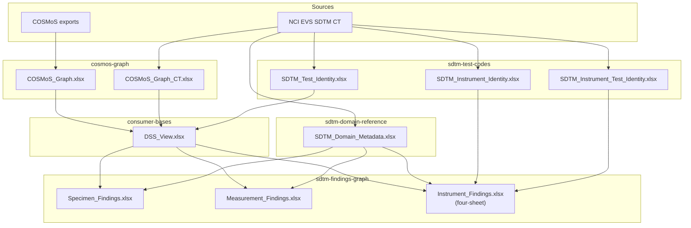
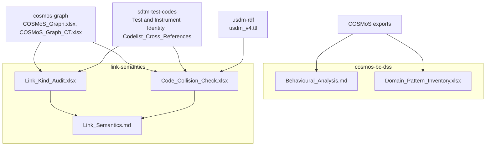

# Data flow

*Moved from the root README, 2026-09-30.*

Two views. The first shows how the reference files and consumer outputs are built. The second shows the analysis work, which reads from the same files but feeds nothing back.

### Reference files and consumer outputs

### Analysis

For how the analytical layers fit together, see [`SDTM_Domain_Overview.md`](../SDTM_Domain_Overview.md).
