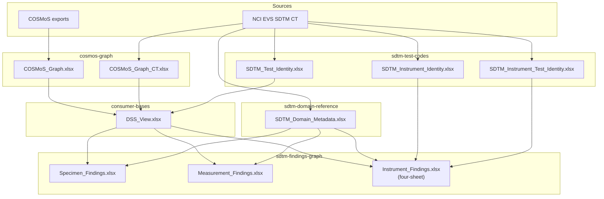
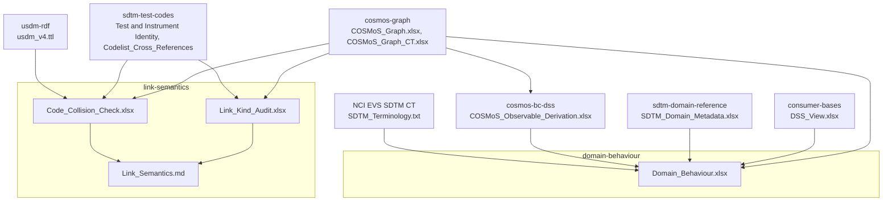

# Data flow

*Moved from the root README, 2026-09-30.*

Two views. The first shows how the reference files and consumer outputs are built. The second shows the analysis work, which reads from the same files but feeds nothing back.

### Reference files and consumer outputs

### Analysis

The March 2026 behavioural analysis and the three-layer overview are archived in [`archive/behavioural-analysis-2026-03/`](archive/behavioural-analysis-2026-03/).

## Release run order

Run each notebook from its own folder. A step reads only files written by earlier steps.

| Step | Track | Notebooks, in order | SDTM CT release | COSMoS release |
|---|---|---|---|---|
| 1 | `sdtm-test-codes/` | `SDTM_CT_Extract` → `SDTM_CT_NCIt_Enrich` → `SDTM_Instrument_Identity_Enrich` → `Codelist_Cross_References` | yes | — |
| 2 | `cosmos-graph/` | `10_flatten_schema_driven` | — | yes |
| 3 | `cosmos-graph/` | `20_resolve_ct` → `30_validate_graph` | yes | yes |
| 4 | `cosmos-graph/` | `50_instrument_category_resolution` → `51_instrument_parent_chain` | — | yes |
| 5 | `consumer-bases/` | `10_dss_view` → `20_dss_variables_view` → `30_pr_dss_reachability` | yes | yes |
| 6 | `cosmos-graph/` | `40_codelist_coverage` (reads `DSS_View.xlsx`) | yes | yes |
| 7 | `sdtm-findings-graph/` | `Scope_Check` → `Specimen_Findings` → `Measurement_Findings` → `Instrument_Findings` | yes | yes |
| 8 | `link-semantics/` | `Link_Kind_Audit` → `Code_Collision_Check` (needs a `usdm-rdf` checkout beside this repo) | yes | yes |
| 9 | `cosmos-bc-dss/` | `COSMoS_Observable_Derivation` → `COSMoS_Observable_LOINC_Check` | — | yes |
| 10 | `domain-behaviour/` | `Domain_Behaviour` (reads `COSMoS_Observable_Derivation.xlsx` from step 9 and stops if it is from another COSMoS package; also reads `SDTM_Terminology.txt` downloaded in step 1; set `PRIOR_FILE` to the previous output for the release diff; also rewrites `docs/analyses/domain-behaviour.html`) | — | yes |

When both release together, run every step. `Scope_Check` stops the refresh if a domain with content is not classified in `SDTM_Domain_Metadata.xlsx`; classify it there, then continue. After the run: update `cosmos-graph/docs/COSMoS_Open_Work.md` and write the release note in `docs/`.
