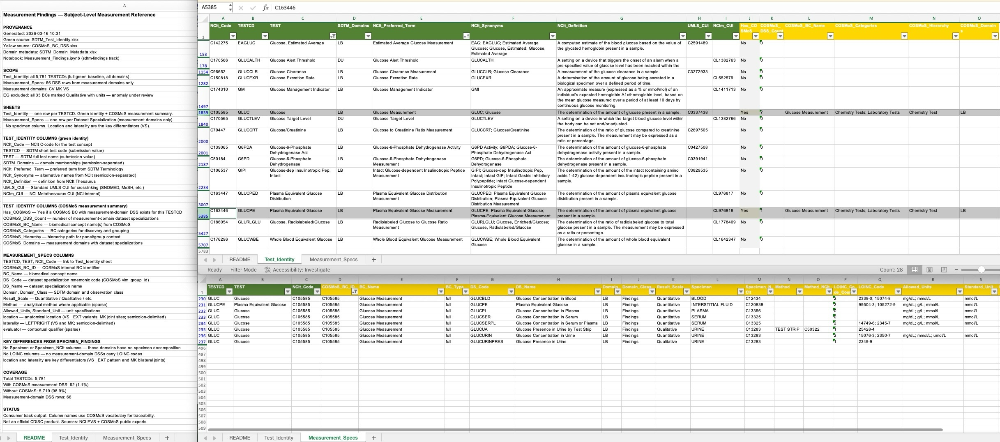

# SDTM Findings — Consumer Track

Consumer-facing reference files that join SDTM test identity with COSMoS measurement specifications, organized by structural type.

## What this track does

The two source tracks — [`sdtm-test-codes`](../sdtm-test-codes/) (what is measured?) and [`cosmos-bc-dss`](../cosmos-bc-dss/) (how is it measured?) — produce independent reference files. This track joins them into structural-type-specific outputs designed for study design, SoA-to-CDISC mapping, and USDM integration.

Each notebook consumes the same source files but applies different join logic and scoping because the three structural types have fundamentally different data shapes.


*Glucose Measurement (C105585) — one BC decomposed into 8 Dataset Specializations in LB. Test_Identity sheet (top), Measurement_Specs sheet (bottom), README sheet (left).*

## Notebooks and outputs

| Notebook | Structural type | Scope | Output |
|---|---|---|---|
| [`Specimen_Findings.ipynb`](notebooks/Specimen_Findings.ipynb) | Specimen-based | LB, MB, MI, CP, BS, MS, PC, PP (IS, GF, UR excluded -- see behavioural analysis) | [`Specimen_Findings.xlsx`](machine_actionable/Specimen_Findings.xlsx) |
| [`Measurement_Findings.ipynb`](notebooks/Measurement_Findings.ipynb) | Measurement | VS, MK, CV (EG deferred) | [`Measurement_Findings.xlsx`](machine_actionable/Measurement_Findings.xlsx) |
| `Instrument_Findings.ipynb` | Instrument-based | QS, FT, RS | `Instrument_Findings.xlsx` *(planned)* |

## Inputs (shared)

| File | Track | Content |
|---|---|---|
| [`SDTM_Test_Identity.xlsx`](../sdtm-test-codes/machine_actionable/SDTM_Test_Identity.xlsx) | sdtm-test-codes | Domain-level test codes with NCIt identity |
| [`SDTM_Instrument_Identity.xlsx`](../sdtm-test-codes/machine_actionable/SDTM_Instrument_Identity.xlsx) | sdtm-test-codes | Instrument-level test codes with NCIt identity |
| [`COSMoS_BC_DSS.xlsx`](../cosmos-bc-dss/interim/COSMoS_BC_DSS.xlsx) | cosmos-bc-dss | Flattened BC/DSS (all 31 domains) |
| [`SDTM_Domain_Metadata.xlsx`](../sdtm-domain-reference/machine_actionable/SDTM_Domain_Metadata.xlsx) | sdtm-domain-reference | Domain metadata (structural type flags) |

## File structure

Each output is a two-sheet Excel file:

- **Test_Identity** — one row per TESTCD (full green baseline), enriched with COSMoS summary for the relevant structural type
- **Measurement_Specs** — one row per Dataset Specialization, scoped to the relevant domains

The link between sheets is TESTCD (and NCIt_Code for precision). This two-step structure matches the mapping workflow: first resolve a term to a concept (TESTCD), then select the specific measurement variant (DS_Code).

## Current state

[`Specimen_Findings.xlsx`](machine_actionable/Specimen_Findings.xlsx) and [`Measurement_Findings.xlsx`](machine_actionable/Measurement_Findings.xlsx) are complete and running. Coverage reflects COSMoS publication status -- domains where COSMoS has not yet published dataset specializations show zero DSS rows. This is a source coverage gap, not a pipeline issue.

`Instrument_Findings.xlsx` is planned but not yet built.

## Coverage gap and sponsor content

The Specimen_Findings file makes the coverage gap concrete: of 4,109 TESTCDs in the specimen-based domains, only 100 have COSMoS measurement specifications (DSSs). The remaining 4,009 have standardized identity (TESTCD, NCIt concept, synonyms, definition) but no operationalized measurement detail (specimen, method, units, LOINC).

For laboratory tests in particular, many sponsors already maintain internal lab test catalogues or registries that carry exactly this operational detail. The Test_Identity sheet provides the standardized anchor: TESTCD and NCIt_Code are the join keys. Where COSMoS has published DSSs, use them. Where it has not, sponsors can map their internal catalogue against Test_Identity to fill the gap -- bridging their own operational content to the CDISC identity layer.

This is most immediately relevant for lab tests (LB), where the 2,474 TESTCDs and rich NCIt enrichment provide a solid matching surface. As COSMoS publishes more DSSs, the Measurement_Specs sheet grows and the gap narrows. But sponsors do not need to wait for that to start using Test_Identity for study design and SoA mapping.

## Pipeline position

```
sdtm-test-codes/SDTM_Test_Identity.xlsx  ──────────┐
sdtm-test-codes/SDTM_Instrument_Identity.xlsx  ────┤
cosmos-bc-dss/COSMoS_BC_DSS.xlsx  ─────────────────┤── sdtm-findings/
sdtm-domain-reference/SDTM_Domain_Metadata.xlsx  ──┘
                                                     │
                    sdtm-findings/machine_actionable/
                      ├── Specimen_Findings.xlsx
                      ├── Measurement_Findings.xlsx
                      └── Instrument_Findings.xlsx   (planned)
```
